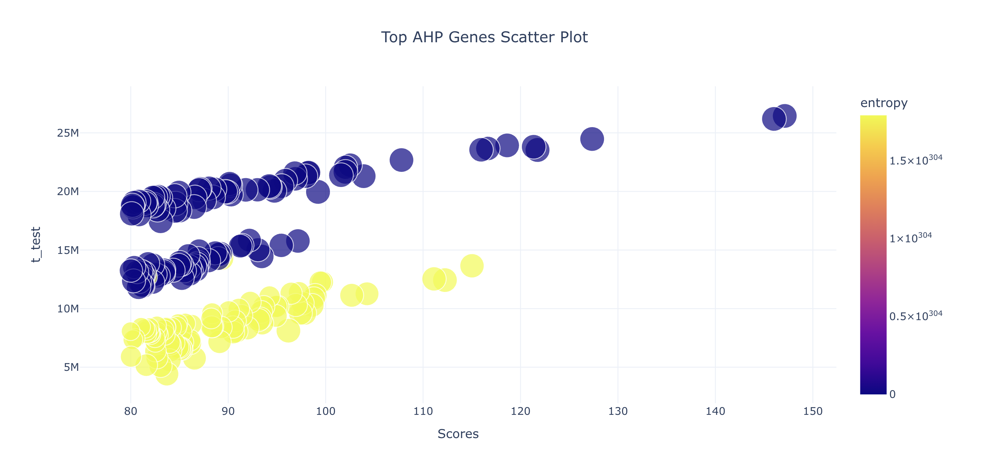
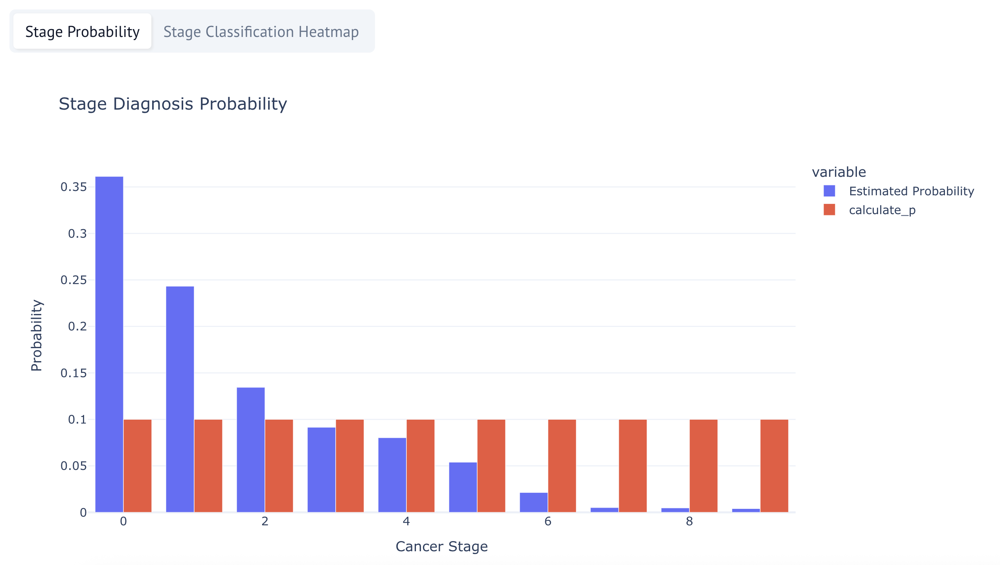
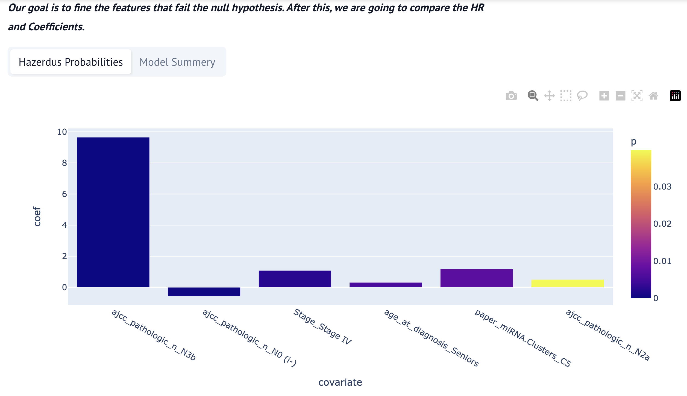

## Project Summery: 

GeneScope is a bioinformatics web application that empowers users to explore breast cancer stage classification using multi-modal deep learning. The platform leverages genomic and clinical data to build predictive models that help interpret how various genetic and physiological factors contribute to cancer progression.

The central aim of GeneScope is to identify genes that are most influential in cancer development and to assess how clinical features like tumor size, lymph node involvement, and patient demographics affect disease staging. By combining statistical analysis with machine learning, the platform offers both a powerful research tool and an accessible educational interface.

### Multimodal Deep Learning Model

At the heart of the platform is a deep learning model that fuses two types of medical data:

* Genomic Data: Captures gene expression levels from patient samples. This data is modeled using a Multi-Layer Perceptron (MLP).

* Clinical Data: Includes tumor metrics, metastatic distance, and demographic features, processed through a CatBoost model.

These two models are integrated through intermediate fusion, where outputs from the genomic and clinical models are combined via an additional MLP layer that performs the final classification of cancer stage. The architecture was optimized using Neural Architecture Search (NAS) with Keras.

To improve robustness and reduce bias from unbalanced datasets, the platform compares this fusion model against a baseline SMOTE-augmented MLP. Despite SMOTE achieving slightly higher accuracy, GeneScope’s fusion model is preferred in medical contexts due to its preservation of clinical data integrity and interpretability.

### Retrival Augmented Generative ChatBot

To make the scientific insights more comprehansive, GeneScope features a LangChain-powered chatbot that acts as a research assistant within the app. This chatbot is backed by a Pinecone vector database, and generates retreval augmented and content aware response from a vectore database of research papers, documentation, and major findings findings.

# Major Findings and Statistical Approaches
GeneScope integrates multiple statistical and machine learning methods to identify key biomarkers and evaluate their role in breast cancer progression. These approaches helped uncover both gene-level and clinical insights that contribute to accurate stage classification and prognosis.

### Analytic Hierarchy Process (AHP)
To prioritize genes based on their biological relevance, Analytic Hierarchy Process (AHP) is utillized. AHP is a structured decision-making method that ranks features according to multiple statistical indicators. AHP is particularly useful in bioinformatics to identify which genes significantly relevant to disease progression.

This ranking system combines the results of five statistical tests commonly used in expression analysis:

* t-test: Measures the mean difference in gene expression between cancerous and non-cancerous samples.

* Entropy: Evaluates the uncertainty or variability in gene expression values.

* Wilcoxon rank-sum test: A non-parametric alternative to the t-test that’s robust to non-normal distributions.

* AUC (Area Under Curve): Measures the discriminatory power of each gene to distinguish between classes.

* Signal-to-Noise Ratio (SNR): Highlights genes with high mean differences relative to their variability.

For each method, genes were ranked based on performance, and pairwise comparison matrices were generated. Then the eigenvectors and eigenvalues of these matrices were computed to derive priority weights, which were averaged to create a final ranking of genes. This ranked list highlights genes most likely to be unregulated or mutated during cancer progression.

### Catboost Model for 

In GeneScope, CatBoost was used to estimate the probability that a patient sample belongs to each breast cancer stage. Rather than assigning a hard label (e.g., Stage II or Stage III), CatBoost generates a probability distribution across all stages, enabling a more flexible and informative view of disease severity.

Compared to manual calculation, the CatBoost model demonstrated superior predictive accuracy by learning complex, nonlinear relationships within the clinical dataset. This allowed for better stratification of borderline cases and more nuanced interpretation of disease progression across patient profiles.

### Cox Proportional Hazards Model

To assess survival risk, we used the Cox Proportional Hazards Model, a statistical technique widely used in medical research. It estimates the hazard ratio, which quantifies how different variables (such as gene expression levels or tumor characteristics) affect the risk of adverse outcomes over time.

## Implementation and Deployment

The frontend is developed using React with TypeScript, providing a responsive and interactive user experience, and is hosted on Vercel for fast, global delivery. The analytical engine and all visualization dashboards, including statistical evaluations, model performance summaries, and gene ranking plots—are built using Marimo, a Python-based interactive notebook framework. These Marimo notebooks are wrapped in a FastAPI interface and served as endpoints through a RapidAPI-style backend, allowing seamless communication between the UI and analytical layer. The entire backend, including API routing and model inference, is deployed on Render, enabling scalable execution of real-time data processing and retrieval-augmented responses.

